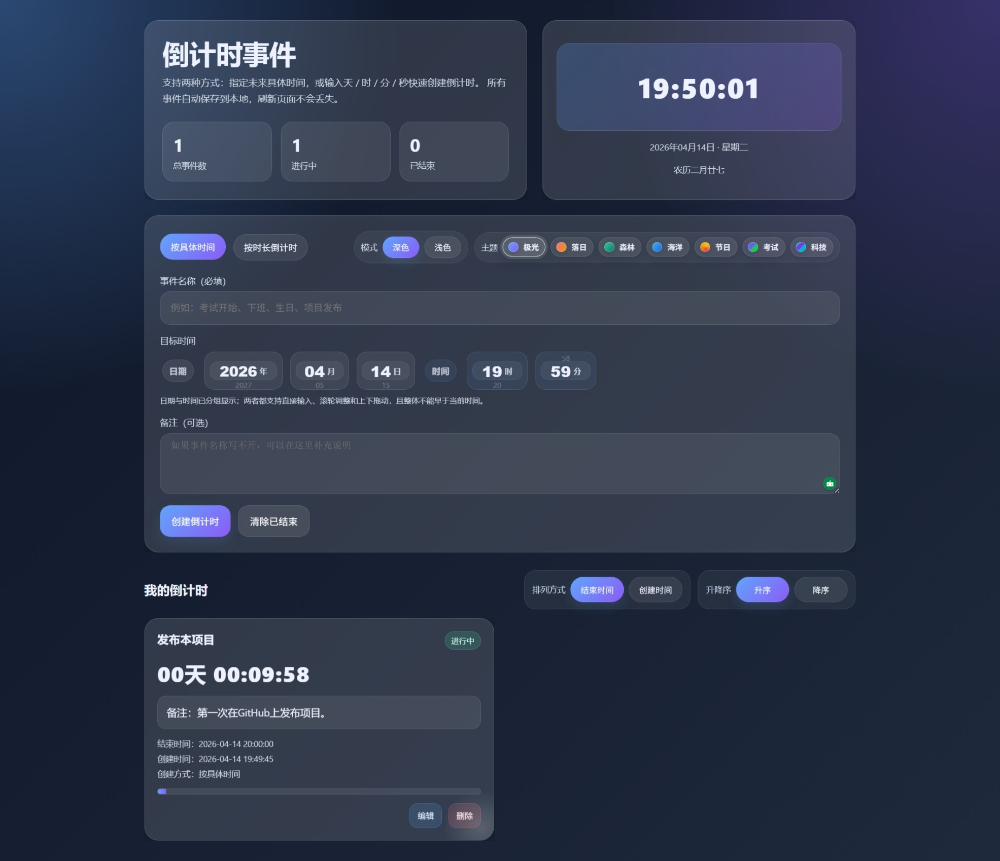

# ⏳ 倒计时管理平台 (Countdown Dashboard)

一款浏览器端倒计时管理工具，打开即用。

## ✨ 核心功能
- **双模式创建**：支持设定具体结束时间，或直接输入 X天X时X分X秒 的剩余时长。
- **沉浸式视觉**：内置 7 种配色主题及深色/浅色模式。
- **智能时间选择**：年月日时分支持鼠标拖拽微调、滚轮调整，且自动规避已过去的时间。
- **农历与位置**：实时显示当前时间对应的农历日期，并尝试获取所在地时区。
- **数据持久化**：所有事件自动存储在浏览器本地，刷新页面不丢失。
- **列表管理**：支持按结束时间/创建时间排序，支持编辑与进度条可视化。

## 🛠 技术栈
- 原生 **HTML5** / **CSS3** (Flex/Grid 布局、CSS 变量)
- 原生 **JavaScript** (ES6)
- **LocalStorage** 本地存储
- **Intl.DateTimeFormat** 农历计算

## 📋 研发版本历程

### [v1.0.0] - 2026-04-14

- 完成平台的基本搭建与部署。

## 📸 预览

## 🚀 快速使用
1. 克隆仓库：`git clone git@github.com:你的用户名/countdown-dashboard.git`
2. 直接用浏览器打开 `index.html` 即可使用。