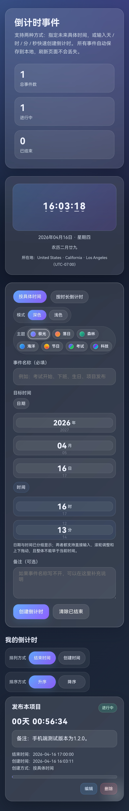

# ⏳ 倒计时管理平台 (Countdown Dashboard)

一款浏览器端倒计时管理工具，打开即用，也可[在线使用](https://bytetraveller.github.io/countdown-dashboard/)。

## ✨ 核心功能
- **双模式创建**：支持设定具体结束时间，或直接输入 X天X时X分X秒 的剩余时长。
- **沉浸式视觉**：内置 7 种配色主题及深色/浅色模式。
- **智能时间选择**：年月日时分支持鼠标拖拽微调、滚轮调整，手机端全面支持滑动拖拽，且自动规避已过去的时间。
- **农历与位置**：实时显示当前时间对应的农历日期，并展示用户 IP 所在地及对应时区。
- **数据持久化**：所有事件自动存储在浏览器本地，刷新页面不丢失。
- **列表管理**：支持按结束时间/创建时间排序，支持编辑与进度条可视化。

## 🛠 技术栈
- 原生 **HTML5** / **CSS3** (Flex/Grid 布局、CSS 变量)
- 原生 **JavaScript** (ES6)
- **LocalStorage** 本地存储
- **Intl.DateTimeFormat** 农历计算
- **PointerEvent & TouchEvent** 跨端拖拽交互
- **IP 定位 API** (ipwho.is / ipapi.co / freeipapi.com 多重降级)

## 📋 研发版本历程

### [v1.2.0] - 2026-04-16 (当前版本)
### ✨ 新增
- **移动端拖拽交互**：手机端全面支持通过**滑动拖拽**的方式调整年月日时分秒数值，操作体验对齐桌面端。
- **跨端事件统一**：重构拖拽逻辑，同时兼容 PointerEvent（桌面）与 TouchEvent（移动端），并加入 `touch-action: none` 防止页面滚动干扰。

### 🔧 优化
- 优化了移动端日期选择器（`.spinner-group.date-group`）与时长选择器（`.duration-combo`）的响应式布局，窄屏下控件自动撑满宽度。
- 调整了 `.hero-right` 和 `.location-info` 在手机端的间距与堆叠逻辑，信息展示更加紧凑清晰。
- 修复了移动端拖拽方向与桌面端不一致的问题（统一为向上滑动增加数值）。

### [v1.1.0] - 2026-04-15
✨ 新增：**IP 定位与时区显示**：右侧信息面板新增用户**所在地**（基于 IP 解析）及对应的**时区信息**展示，支持多 API 降级与本地缓存。

### [v1.0.0] - 2026-04-14

- 完成平台的基本搭建与部署。

## 📸 预览
<figure>
  
  <figcaption align="center"><b>桌面端界面</b></figcaption>
</figure>

<figure>
  
  <figcaption align="center"><b>手机端界面</b></figcaption>
</figure>

## 📂 本地运行
克隆仓库：
   ```bash
   git clone git@github.com:ByteTraveller/countdown-dashboard.git